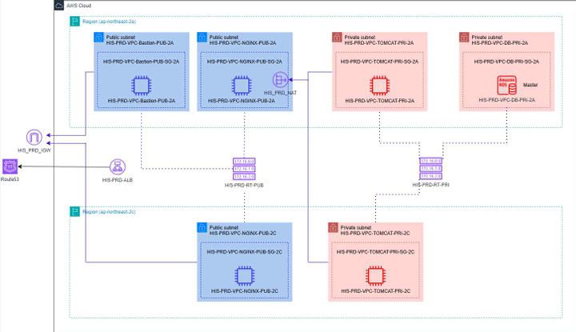
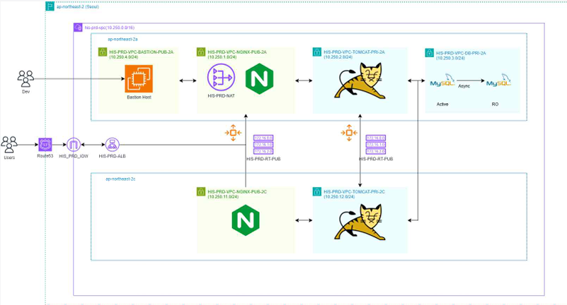

# 01. 인프라 구성도
[← 목차로 돌아가기](../README.md)

## 전체 구성

- **리전:** ap-northeast-2 (Seoul)
- **VPC:** HIS-PRD-VPC (`10.250.0.0/16`)
- **가용 영역:** ap-northeast-2a / ap-northeast-2c




---

## 네트워크 구성

### ap-northeast-2a
| 계층 | 서브넷 | CIDR | 주요 리소스 |
|------|--------|------|------------|
| Public | HIS-PRD-VPC-BASTION-PUB-2A | 10.250.4.0/24 | Bastion Host |
| Public | HIS-PRD-VPC-NGINX-PUB-2A | 10.250.1.0/24 | Nginx, NAT Gateway |
| Private | HIS-PRD-VPC-TOMCAT-PRI-2A | 10.250.2.0/24 | Tomcat |
| Private | HIS-PRD-VPC-DB-PRI-2A | 10.250.3.0/24 | RDS (Active) |

### ap-northeast-2c
| 계층 | 서브넷 | CIDR | 주요 리소스 |
|------|--------|------|------------|
| Public | HIS-PRD-VPC-NGINX-PUB-2C | 10.250.11.0/24 | Nginx |
| Private | HIS-PRD-VPC-TOMCAT-PRI-2C | 10.250.12.0/24 | Tomcat |
| Private | HIS-PRD-VPC-DB-PRI-2C | 10.250.13.0/24 | RDS (Read Only) |

---

## 트래픽 흐름

```
Users
  │
  ▼
Route 53 (history-cloud.store)
  │
  ▼
Internet Gateway (HIS-PRD-IGW)
  │
  ▼
ALB (HIS-PRD-ALB / HIS-NGINX-ALB)
  │
  ▼
Nginx (Public Subnet, 2A / 2C)  ──[Reverse Proxy]──►  Tomcat (Private Subnet, 2A / 2C)
                                                          │
                                                          ▼
                                                     RDS MySQL (Private Subnet)
```

- **Public 라우팅(HIS-PRD-RT-PUB):** `0.0.0.0/0` → Internet Gateway
- **Private 라우팅(HIS-PRD-RT-PRI):** `0.0.0.0/0` → NAT Gateway
- **Bastion Host:** 개발자(Dev)가 Private 서버에 SSH 접근하기 위한 관문
