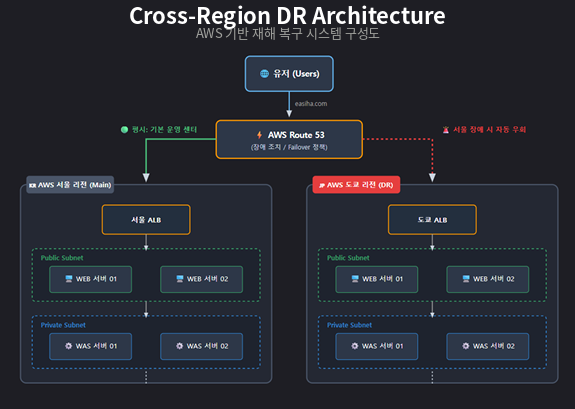

# DR 재해복구 시스템 구축

> AWS **서울 리전(Main)** 과 **도쿄 리전(DR)** 을 이중화하여,
> 주 센터 장애 시 **서비스 중단 없이 자동으로 백업 리전으로 우회**되도록 구성한 재해복구(Disaster Recovery) 프로젝트입니다.

---

## 프로젝트 개요

카카오·대전 정부 데이터센터 화재처럼 **단일 데이터센터 장애가 곧 전체 서비스 마비로 이어지는 문제**를,
지리적으로 격리된 두 AWS 리전과 Route 53 Failover 라우팅으로 해결한 **Active–Passive DR 아키텍처**입니다.
서울 리전을 강제로 다운시켰을 때 트래픽이 도쿄 리전으로 자동 전환되고, 복구 후 다시 서울로 회귀하는 것까지 검증했습니다.

| 항목 | 내용 |
|------|------|
| **목표** | 주 센터(서울) 장애 시 서비스 연속성을 보장하는 재해복구 체계 구축 |
| **전략** | Cross-Region Active–Passive (Failover) |
| **주 센터 (Main)** | AWS 서울 리전 `ap-northeast-2` |
| **백업 센터 (DR)** | AWS 도쿄 리전 `ap-northeast-1` |
| **트래픽 제어** | AWS Route 53 (Failover Routing + Health Check) |
| **검증 애플리케이션** | DVWA (Damn Vulnerable Web Application) |
| **검증 범위** | 서울 장애 → 도쿄 자동 전환 → 서울 복구 회귀 (웹 페일오버) |

---

## 아키텍처

- **평시**: 모든 트래픽은 Primary인 서울 리전으로 라우팅됩니다.
- **장애 시**: Route 53 Health Check가 서울 ALB의 이상을 감지하면, 자동으로 Secondary인 도쿄 리전으로 우회합니다.
- 서울과 도쿄는 동일한 **ALB → WEB → WAS** 구성으로 이중화되어 있습니다.

---

## 목차

| 문서 | 내용 |
|------|------|
| [01. 배경 및 개념](docs/01-background.md) | 데이터센터 화재 사례, DR이란 무엇인가, 왜 필요한가 |
| [02. 아키텍처 상세](docs/02-architecture.md) | 구성도, 리전/서브넷 설계 근거 |
| [03. 구축 과정](docs/03-implementation.md) | AMI 복제 → 인스턴스 생성 → Route 53 Failover → 전환 검증까지 단계별 |
| [04. 주의 사항 및 검증](docs/04-checklist.md) | 실무 체크리스트, 트러블슈팅, 배운 점 |

---

## 기술 스택
`AWS` · `EC2` · `AMI` · `ALB` · `VPC` · `Public/Private Subnet` · `Security Group` `Route 53` · `Failover Routing` · `Health Check` · `Hosted Zone` · `tcpdump`

---

## 결과

- 주 센터(서울) 장애 상황에서 **백업 센터(도쿄)로의 자동 전환**을 실제로 재현·검증했습니다.
- 원상 복구 시 트래픽이 다시 서울 리전으로 정상 회귀하는 것까지 확인했습니다.
- 사람의 수동 개입 없이 DNS 레벨에서 페일오버가 동작함을 패킷 캡처로 입증했습니다.

