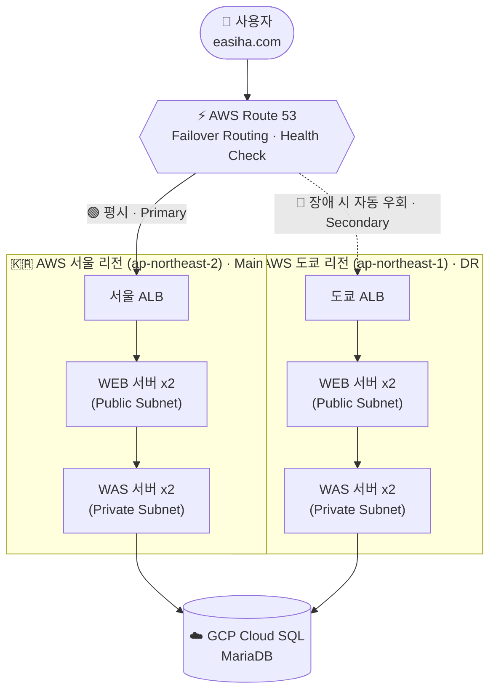

# DR 재해복구 시스템 구축

> AWS **서울 리전(Main)** 과 **도쿄 리전(DR)** 을 이중화하고, GCP Cloud SQL을 공용 DB로 두어
> 주 센터 장애 시 **서비스 중단 없이 자동으로 백업 리전으로 우회**되도록 구성한 재해복구(Disaster Recovery) 프로젝트입니다.

---

## 프로젝트 개요

| 항목 | 내용 |
|------|------|
| **목표** | 주 센터(서울) 장애 시 서비스 연속성을 보장하는 재해복구 체계 구축 |
| **전략** | Cross-Region Active–Passive (Failover) |
| **주 센터 (Main)** | AWS 서울 리전 `ap-northeast-2` |
| **백업 센터 (DR)** | AWS 도쿄 리전 `ap-northeast-1` |
| **공용 데이터베이스** | GCP Cloud SQL (MariaDB) — 멀티 클라우드 구성 |
| **트래픽 제어** | AWS Route 53 (Failover Routing + Health Check) |
| **검증 애플리케이션** | DVWA (Damn Vulnerable Web Application) |

---

## 아키텍처

- **평시**: 모든 트래픽은 Primary인 서울 리전으로 라우팅됩니다.
- **장애 시**: Route 53 Health Check가 서울 ALB의 이상을 감지하면, 자동으로 Secondary인 도쿄 리전으로 우회합니다.
- **데이터 계층**: 두 리전이 GCP Cloud SQL(MariaDB)를 공용으로 바라보게 하여, 리전 전환 후에도 데이터 연속성을 유지합니다.

> 📷 실제 구성도 이미지는 [`docs/02-architecture.md`](docs/02-architecture.md) 참고

---

## 핵심 포인트

- **지리적 격리** — 주 센터와 백업 센터를 물리적으로 멀리 떨어진 리전에 배치해, 하나의 재난이 두 센터를 동시에 무너뜨리지 못하도록 설계했습니다. (도쿄 시내에 둘 다 두면 대지진에 함께 붕괴)
- **자동 장애 조치(Failover)** — Route 53의 Primary/Secondary 레코드와 Health Check로 사람의 개입 없이 트래픽을 전환합니다.
- **멀티 클라우드 DB** — AWS 컴퓨팅 계층과 GCP DB 계층을 분리해, 특정 클라우드 벤더 리전 장애의 영향을 줄였습니다.
- **실제 전환 검증** — 서울 리전 웹 포트를 차단해 장애를 시뮬레이션하고, `tcpdump`로 트래픽이 도쿄로 넘어가는 것과 복구 후 서울로 되돌아오는 것까지 패킷 레벨에서 확인했습니다.

---

## 목차

| 문서 | 내용 |
|------|------|
| [01. 배경 및 개념](docs/01-background.md) | 데이터센터 화재 사례, DR이란 무엇인가, 왜 필요한가 |
| [02. 아키텍처 상세](docs/02-architecture.md) | 구성도, 리전/서브넷/DB 설계 근거 |
| [03. 구축 과정](docs/03-implementation.md) | AMI 복제 → 인스턴스 생성 → Route 53 Failover → 전환 검증까지 단계별 |
| [04. 주의 사항 및 검증](docs/04-checklist.md) | 실무 체크리스트, 트러블슈팅, 배운 점 |

---

## 기술 스택

| 구분 | 사용 기술 |
|------|-----------|
| **Compute** | AWS EC2 (Red Hat Enterprise Linux), AMI 크로스 리전 복제 |
| **Network / LB** | AWS ALB, VPC (Public/Private Subnet), Security Group |
| **DNS / Failover** | AWS Route 53 (Hosted Zone, Failover Routing, Health Check) |
| **Database** | GCP Cloud SQL (MariaDB) |
| **App / Test** | DVWA, tcpdump (패킷 검증) |

---

## 결과

- 주 센터(서울) 장애 상황에서 **백업 센터(도쿄)로의 자동 전환**을 실제로 재현·검증했습니다.
- 리전 전환 후에도 GCP 공용 DB를 통해 **데이터 연속성**을 확인했습니다.
- 원상 복구 시 트래픽이 다시 서울 리전으로 정상 회귀하는 것까지 확인했습니다.

> ⬅️ [이력서로 돌아가기](../../README.md)
