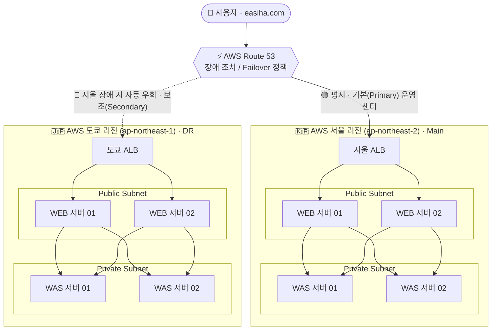

# 02. 아키텍처 상세

## Cross-Region DR Architecture

AWS 서울(Main)·도쿄(DR) 두 리전을 이중화한 재해복구 시스템입니다.

---

## 계층별 설계

### 1) 트래픽 / DNS 계층 — AWS Route 53
- **Failover 라우팅 정책**으로 Primary(서울)·Secondary(도쿄) 레코드를 구성합니다.
- **Health Check**로 서울 ALB 상태를 감시하다가, 이상 감지 시 트래픽을 도쿄로 자동 전환합니다.
- 사용자 진입점 도메인: `easiha.com`

### 2) 로드밸런싱 / 컴퓨팅 계층 — AWS (양 리전 동일 구성)
| 계층 | 구성 |
|------|------|
| **ALB** | 리전별 Application Load Balancer |
| **WEB (Public Subnet)** | WEB 서버 2대 — 외부 요청 수신 |
| **WAS (Private Subnet)** | WAS 서버 2대 — 애플리케이션 처리, 외부에 직접 노출되지 않음 |

- 도쿄(DR) 리전은 서울(Main) 리전과 **동일한 WEB/WAS/ALB 구성**으로 복제합니다.
- OS: Red Hat Enterprise Linux, 검증 애플리케이션: DVWA.

> 본 프로젝트의 검증 범위는 **웹 계층의 리전 간 페일오버**입니다. 별도의 DB 계층은 구성하지 않았으며, 서울 장애 시 도쿄 리전에서 웹 서비스가 정상 응답하는지를 확인하는 데 초점을 맞췄습니다.

---

## 설계 근거 (Why)

| 선택 | 이유 |
|------|------|
| **크로스 리전(서울↔도쿄)** | 하나의 재난이 두 센터를 동시에 무너뜨리지 못하도록 지리적으로 격리 |
| **Active–Passive (Failover)** | 평시 비용을 낮추면서도 장애 시 자동 전환 보장 |
| **AMI 크로스 리전 복제** | 서울 인스턴스를 그대로 도쿄에 재현해 구성 편차·구축 시간 최소화 |
| **Route 53 Health Check** | 사람의 수동 개입 없이 장애 감지 → 전환 자동화 |

---

## 주요 리소스 참고값 (실습 기준)

| 항목 | 값 |
|------|-----|
| 도메인 | `easiha.com` |
| 서울 ALB | `dualstack.dvwa-...ap-northeast-2.elb.amazonaws.com` |
| 도쿄 ALB | `dualstack.dvwa-...ap-northeast-1.elb.amazonaws.com` |
| Route 53 레코드 | `Seoul-Main-Active`(Primary) / `Tokyo-backup-DR`(Secondary) |

---

⬅️ 이전: [01. 배경 및 개념](01-background.md) · ➡️ 다음: [03. 구축 과정](03-implementation.md)
