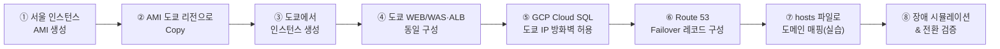

# 03. 구축 과정

서울(Main) → 도쿄(DR) 복제부터 Route 53 자동 장애 조치, 전환 검증까지의 전체 흐름입니다.



---

## ① ~ ③ 인스턴스 크로스 리전 복제

1. **AMI 생성** — 도쿄 리전으로 보낼 서울 인스턴스를 선택하고 `AMI 복사` 기능으로 이미지를 만듭니다.
   - EC2 → 이미지 → AMI → 대상 인스턴스 선택 → `작업 ▸ AMI 복사`
2. **도쿄 리전으로 Copy** — AMI 복사 화면에서
   - 원본 AMI: `ap-northeast-2 (서울)`
   - **대상 리전: 아시아 태평양 (도쿄)** 로 지정 → `AMI 복사`
3. **도쿄에서 인스턴스 생성** — 도쿄 리전으로 넘어온 AMI(`내 AMI`)로 인스턴스를 시작합니다. (예: `dvwa`, 인스턴스 유형 `t3.micro`)

> 📷 `images/ami-copy.png`, `images/launch-instance.png` 등으로 스크린샷 첨부 가능

---

## ④ 도쿄 리전 컴퓨팅 계층 구성

- 서울 리전과 **동일하게 WEB / WAS 로드밸런서 및 인스턴스**를 구성합니다.
- 인스턴스 생성 후 퍼블릭 IPv4 주소를 확인합니다. (예: 실행 중 상태 확인)

## ⑤ GCP Cloud SQL 방화벽 허용

- 도쿄 리전 WAS가 공용 DB에 접근할 수 있도록, **GCP Cloud SQL에서 도쿄 퍼블릭 IP를 방화벽에 허용**합니다.

---

## ⑥ Route 53 — DNS & Failover 레코드 구성

### 6-1. 호스팅 영역 생성
- Route 53 → **호스팅 영역** → `호스팅 영역 생성`
- 도메인 이름: `easiha.com`, 유형: **퍼블릭 호스팅 영역**
- 생성 시 기본 **NS / SOA 레코드**가 자동 생성됩니다.

### 6-2. 도쿄(DR) 레코드 — Secondary
`레코드 생성`에서:
- **별칭(Alias)** 활성화 → 트래픽 라우팅 대상: **Application/Classic Load Balancer에 대한 별칭**
- 리전: **아시아 태평양(도쿄)** → 도쿄 ALB 선택
- 라우팅 정책: **장애 조치(Failover)**
- 장애 조치 레코드 유형: **보조(Secondary)**
- 레코드 ID: `Tokyo-backup-DR`

### 6-3. 서울(Main) 레코드 — Primary
`다른 레코드 추가`로 Tokyo 레코드와 동일하게 설정하되:
- 리전: **아시아 태평양(서울)** → 서울 ALB 선택
- 장애 조치 레코드 유형만 **기본(Primary)** 으로 설정
- 레코드 ID: `Seoul-Main-Active`
- → `레코드 생성`

### 6-4. 결과 확인
호스팅 영역에 레코드 4개가 생성됩니다.

| 레코드 | 유형 | 라우팅 | 장애 조치 |
|--------|------|--------|-----------|
| easiha.com | A | 장애 조치 | **기본(서울)** |
| easiha.com | A | 장애 조치 | **보조(도쿄)** |
| easiha.com | NS | 단순 | - |
| easiha.com | SOA | 단순 | - |

> WEB 레코드 설정을 확인하고, WAS도 동일하게 **프라이빗 호스팅 영역**으로 구성합니다.

---

## ⑦ hosts 파일로 도메인 매핑 (실습 환경)

실습 환경에서는 실제 도메인을 구매할 수 없으므로, 접속 PC의 hosts 파일에서 도메인을 직접 매핑합니다.

- 경로: `C:\Windows\System32\drivers\etc\hosts`
- 서울 리전 IP·도쿄 리전 IP와 도메인(`easiha.com`)을 추가합니다.

```text
#13.124.60.35   easiha.com    ← 서울 리전 (평시엔 이 라인 사용)
3.113.17.137    easiha.com    ← 도쿄 리전 (DR)
```

---

## ⑧ 장애 시뮬레이션 & 전환 검증

### 8-1. 평시 — 서울 리전 수신 확인
- 준비한 도메인으로 접속한 뒤, `tcpdump`로 **서울 리전에만 패킷이 들어오는지** 확인합니다.

```bash
tcpdump -i any -A port 80
```

### 8-2. 장애 유발
- **서울 리전 보안 그룹에서 인바운드 웹 Port를 제외**하여 장애를 시뮬레이션합니다.
  (인바운드 규칙에 SSH 22, HTTPS 443만 남기고 웹 포트 제거)
- 접속 PC의 hosts 파일에서 **서울 리전 IP 라인을 주석 처리**합니다.

### 8-3. 도쿄(DR) 전환 확인
- 다시 접속해 **도쿄 리전에 데이터(패킷)가 들어오는지** `tcpdump`로 확인합니다. → 자동 우회 성공.

### 8-4. 원상 복구 확인
- 서울 리전을 정상화한 뒤, **서울 리전에서 다시 데이터를 잘 받아오는지** 확인합니다. → Primary로 정상 회귀.

---

⬅️ 이전: [02. 아키텍처 상세](02-architecture.md) · ➡️ 다음: [04. 주의 사항 및 검증](04-checklist.md)
