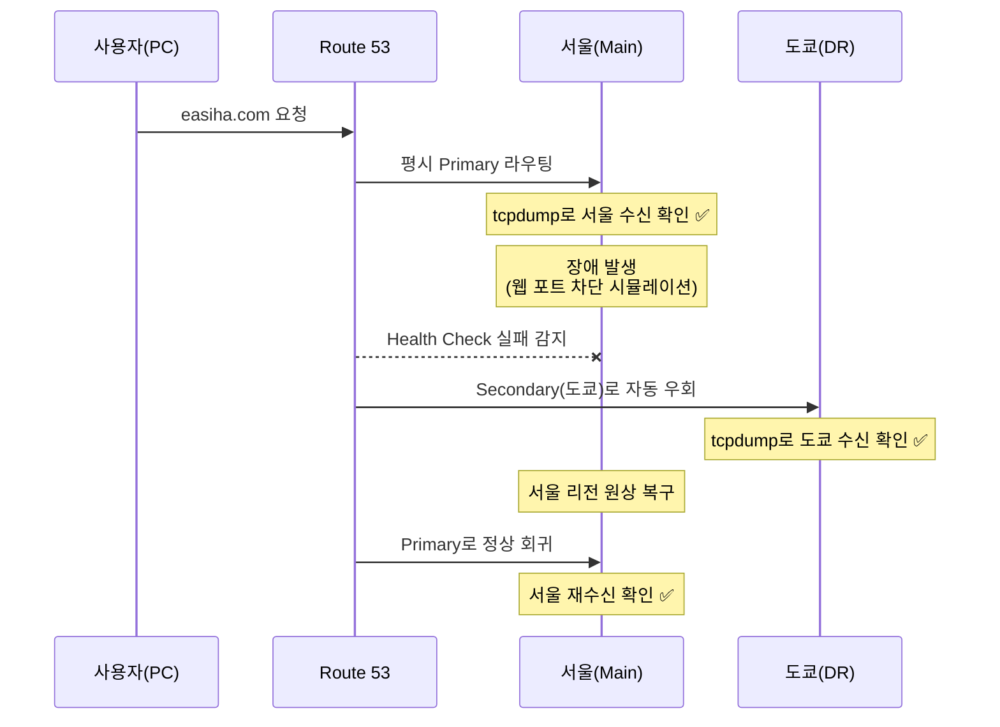

# 04. 주의 사항 및 검증

## ⚠️ 주의 및 확인 사항 (실무 체크리스트)

| # | 항목 | 상세 |
|---|------|------|
| 1 | **리전 종속 설정 값 수정** | 도쿄 리전으로 이동 시 WEB·WAS에 연결된 설정 IP·엔드포인트 값(내부 서버 참조 등)이 서울 기준으로 남아 있지 않은지 확인하고 도쿄 기준으로 수정합니다. |
| 2 | **DR 리전 단독 검증** | Route 53 설정 **전에** 도쿄 리전 자체(ALB 및 단독 접속)가 정상 작동하는지 먼저 확인합니다. DR이 애초에 안 뜨면 Failover는 의미가 없습니다. |
| 3 | **DNS 캐시 초기화** | 로컬 테스트·검증 시 브라우저 및 OS의 **DNS 캐시 초기화가 필수**입니다. 캐시 때문에 전환이 안 된 것처럼 보일 수 있습니다. |
| 4 | **전환 후 응답 검증** | 크로스 리전 전환 후 도쿄 리전이 실제로 웹 요청에 정상 응답하는지, 세션이 유지되는지 확인합니다. |

---

## 🧰 유용한 명령어

**Windows — DNS 캐시 초기화**
```bat
ipconfig /flushdns
```

**Linux — 리전별 수신 트래픽 확인**
```bash
# 80번 포트로 들어오는 패킷 확인 (전환 검증용)
tcpdump -i any -A port 80
```

---

## 🔎 전환 검증 흐름 요약



---

## 💡 배운 점 / 회고

- **DR은 "복제"가 아니라 "전환 검증"이 핵심**이라는 걸 체감했습니다. 백업 리전을 만들어 두는 것보다, 실제 장애 상황에서 사람 개입 없이 전환되고 되돌아오는지를 검증하는 과정이 더 중요했습니다.
- **DNS 캐시** 때문에 "전환이 안 되는 것처럼 보이는" 함정을 겪으며, 검증 시 캐시 초기화를 습관화하게 되었습니다.
- 이번 프로젝트는 **웹 계층의 리전 간 페일오버**까지 검증했습니다. 실제 서비스 수준으로 확장하려면 데이터 계층의 리전 간 복제·정합성(예: DB 복제, 세션 스토어 공유)이 다음 과제가 됩니다.

---

⬅️ 이전: [03. 구축 과정](03-implementation.md) · 🏠 [프로젝트 홈](../README.md)
