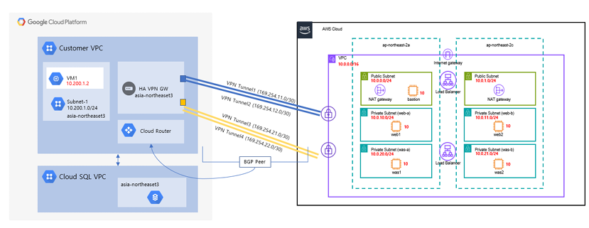

# 01. 아키텍처 구조
[← 목차로 돌아가기](../README.md)


## 전체 구조



<!-- PDF의 '아키텍처 구조' 슬라이드를 캡처해서 images/architecture.png 로 저장하세요 -->

AWS와 GCP를 각각 서울 리전에 구축하고, 두 VPC를 IPsec VPN 사설 터널로 연결한 멀티클라우드 구조입니다.

- **AWS** — Terraform(IaC)으로 3-Tier 웹 서비스(Web / WAS / DB)를 멀티 AZ에 구축
- **GCP** — 콘솔로 Cloud SQL(MySQL) 구축, 비공개 IP 전용으로 운영
- **연결** — 두 VPC를 HA VPN + BGP로 사설 연결

---

## 핵심 트래픽 흐름

```
애플리케이션
  → db.cloud.local (Route 53 사설 DNS)
  → 비공개 IP로 해석
  → VPN 터널 경유
  → GCP Cloud SQL 접속
```

이름(`db.cloud.local`)으로 접속을 요청하면 사설 DNS가 이를 Cloud SQL의 비공개 IP로 해석하고,
그 트래픽이 VPN 터널을 통해 GCP의 Cloud SQL에 도달합니다.

---

## 네트워크 대역

| 구분 | 대역 |
|------|------|
| AWS VPC | `10.0.0.0/16` |
| GCP VPC (historynet) | `10.200.1.0/24` |
| GCP Cloud SQL (servicenetworking) | `10.255.16.0/24` |

---

## 구성 특징

- **고가용성** — AWS는 멀티 AZ(2A·2C), VPN은 터널 4개 풀메시로 이중화
- **보안** — Cloud SQL은 공인 IP 없이 비공개 IP만 사용, VPN을 통해서만 접근
- **동적 라우팅** — BGP로 양측 경로를 자동 교환 (ASN 65000 ↔ 64512)
- **서비스 디스커버리** — 사설 DNS로 IP 변경에 무관하게 이름 기반 접속
