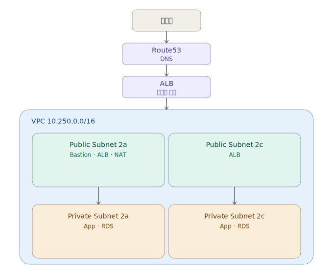

# Terraform 프로젝트

## 프로젝트 개요

제공된 Terraform(HCL) 코드를 리소스별로 분석하고, **HCP Terraform ↔ GitHub 연동**으로 GitOps 자동 배포 파이프라인을 직접 구성했습니다.
GitHub push → 자동 `plan` · `apply`로 VPC부터 ALB · Auto Scaling까지 코드로 배포하고, 실제 도메인 `history-cloud.store` 서비스 정상 동작까지 검증했습니다.

> 📌 인프라 코드(`.tf`)는 제공되었으며, 코드 분석 · 연동 · 변수 설정 · 배포 · 도메인 연결을 직접 수행했습니다.

---

## 목차

1. [IaC 개념](./docs/01-concept.md) — Infrastructure as Code란 무엇인가
2. [Terraform 구성요소](./docs/02-components.md) — HCL · State · Resource · Module · Backend
3. [워크플로우 & 주요 명령어](./docs/03-workflow.md) — Write → Init → Plan → Apply → Destroy 와 핵심 명령어
4. [CI/CD & GitOps](./docs/04-cicd.md) — 지속적 통합/배포와 HCP Terraform 기반 GitOps
5. [인프라 구축 상세](./docs/05-project.md) — 디렉토리 구조 · 리소스별 코드 · HCP 배포 흐름

---

## 기술 스택

`Terraform` · `HCL` · `HCP Terraform` · `GitOps` · `GitHub(VCS)`
`AWS` · `VPC` · `EC2` · `Auto Scaling` · `ALB` · `RDS`
`Route53` · `ACM`

---

## 아키텍처 한눈에 보기

- **네트워크**: VPC(`10.250.0.0/16`) 내 멀티 AZ(2a · 2c) 퍼블릭/프라이빗 서브넷 구성
- **보안**: 용도별 보안 그룹 분리, Bastion 경유 접근으로 외부 노출 최소화
- **확장성**: Launch Template + Auto Scaling으로 인스턴스 자동 증감
- **자동화**: HCP Terraform ↔ GitHub 연동으로 GitOps 배포
